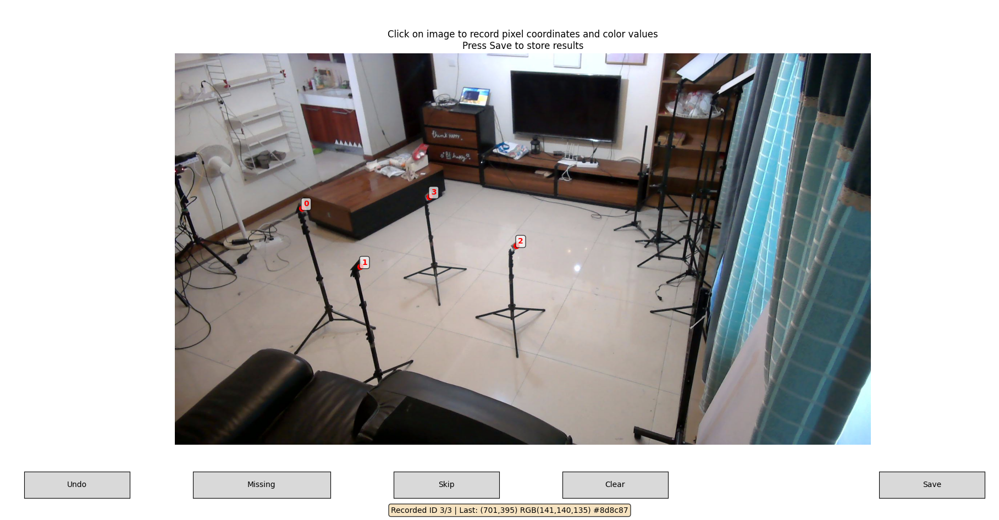

# DataProcess
1. 提前复制相机的内参到 calib 文件夹中

2. [相机外参获取](Calib/get_camera_extrinsic.py)

只需要修改 parse_args 函数中的 data_path、save_path即可，随后运行；

运行完成后期望：在 calib 文件夹中产生 7 组 extrinsic_T_cam_X_to_cam_ref.npy 文件

3. [相机外参验证](Calib/check_in&ex.py)

只需要修改 parse_args 函数中的 data_path、calib_path即可（只需要修改日期字段即可），随后运行；

运行完成后期望：命令行输出：
```text
========== check extrinsic group=group_005 ==========
[INFO] group=group_005, used_cameras=['A', 'B', 'C', 'D', 'E', 'F', 'G', 'H'], num_valid_points=576
[INFO] mean=0.004220 m, rmse=0.004618 m, median=0.004084 m, max=0.012606 m
[INFO] plane_mean=0.000518 m, plane_rmse=0.000639 m, plane_max=0.002366 m
```
其中误差均在毫米或亚毫米量级即可

4. [角反在相机阵列下的坐标系获取](Calib/get_R_t_between_radar_cam.py)

修改：
- root_path 修改方式： 修改日期字段以及后续的组号 group_006 - group_010 (当某组数据实在是无法通过修改参数获取正确的对齐方式时可更改)
- radar_selected 修改方式每组数据都需要修改 low 和 high 后运行 (确保low high 均由一组数据产生)

运行过程中：会弹出拍摄的角反照片，按照角反的实际位置进行编号，随后在照片上点击确定角反位置，如图所示，若相机未拍摄到某个角反点击missing即可，选择完成后点击save。
重复操作直至8台相机全部完成，注意跨相机仍需保持角反序号一致。
对齐后会画出雷达点云和角反标注结果，可根据实际安装的位置进行评估（角反序号与位置）
命令行输出：雷达点到对应角点RMSE: xxx m 在厘米级即可，保留误差最小的外参结果即可。

运行完成后期望：calib_path 文件夹下 产生 corner_pixels_xxx.pkl, extrinsic_img_to_radar_high.npz, extrinsic_img_to_radar_low.npz

5. [图像2D检测](Img2Keypoint/pipeline.py)

parse_args 中的所有参数修改：
- data_path 修改示例： 20260702\data_collection

运行完成后期望：group_xxx\camera results\2D 文件夹下有8台相机的文件夹，文件夹下有数据即可

6. [图像3D结果获取](Img2Keypoint/batch_reconstruct_postprocess.py)

parse_args 中的所有参数修改：
- data_path 修改示例： 20260702\data_collection

运行完成后期望：group_xxx\camera results\2D 文件夹下有8台相机的文件夹，文件夹下有数据即可

7. [结果检查](Vis/display_sensor_results.py)

修正root_path即可，其余配置不动，关注：
- 关键点是否正确（相机外参验证）（边界上）
- 点云是否在人体周围（雷达与相机外参验证）